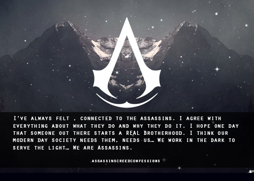

# Coder's Creed.
## Nothing is true; everything is permitted

<!-- <a href="#">
  
</a>
<a href="#"> -->
## We work in the dark to serve the light
  
</a>

### Welcome to my repo, you are visitor


### Top languages
[](https://github.com/anuraghazra/github-readme-stats)

Here are some ideas to get you started:

- 🔭 I’m currently studying at Northeastern University.
- 🌱 I’m currently learning data science, leetcode solution, quantitative strategy on crypto
- 👯 I’m looking to collaborate on some quantitative strategy on doge ,bit and eth
- 📫 How to reach me: yunethecoder@gmail.com
- 😄 Pronouns: he/him
- ⚡ Fun fact: Php is the best coding language.非常擅长写底层青年文学的coder。

<!--START_SECTION:waka-->


**🐱 My GitHub Data** 

> 📦 510.2 kB Used in GitHub's Storage 
 > 
> 🏆 8 Contributions in the Year 2024
 > 
> 🚫 Not Opted to Hire
 > 
> 📜 67 Public Repositories 
 > 
> 🔑 12 Private Repositories 
 > 
**I'm an Early 🐤** 

```text
🌞 Morning                45 commits          ⬛⬛⬜⬜⬜⬜⬜⬜⬜⬜⬜⬜⬜⬜⬜⬜⬜⬜⬜⬜⬜⬜⬜⬜⬜   06.67 % 
🌆 Daytime                357 commits         ⬛⬛⬛⬛⬛⬛⬛⬛⬛⬛⬛⬛⬛⬜⬜⬜⬜⬜⬜⬜⬜⬜⬜⬜⬜   52.89 % 
🌃 Evening                237 commits         ⬛⬛⬛⬛⬛⬛⬛⬛⬛⬜⬜⬜⬜⬜⬜⬜⬜⬜⬜⬜⬜⬜⬜⬜⬜   35.11 % 
🌙 Night                  36 commits          ⬛⬜⬜⬜⬜⬜⬜⬜⬜⬜⬜⬜⬜⬜⬜⬜⬜⬜⬜⬜⬜⬜⬜⬜⬜   05.33 % 
```
📅 **I'm Most Productive on Thursday** 

```text
Monday                   121 commits         ⬛⬛⬛⬛⬜⬜⬜⬜⬜⬜⬜⬜⬜⬜⬜⬜⬜⬜⬜⬜⬜⬜⬜⬜⬜   17.93 % 
Tuesday                  110 commits         ⬛⬛⬛⬛⬜⬜⬜⬜⬜⬜⬜⬜⬜⬜⬜⬜⬜⬜⬜⬜⬜⬜⬜⬜⬜   16.30 % 
Wednesday                75 commits          ⬛⬛⬛⬜⬜⬜⬜⬜⬜⬜⬜⬜⬜⬜⬜⬜⬜⬜⬜⬜⬜⬜⬜⬜⬜   11.11 % 
Thursday                 132 commits         ⬛⬛⬛⬛⬛⬜⬜⬜⬜⬜⬜⬜⬜⬜⬜⬜⬜⬜⬜⬜⬜⬜⬜⬜⬜   19.56 % 
Friday                   66 commits          ⬛⬛⬜⬜⬜⬜⬜⬜⬜⬜⬜⬜⬜⬜⬜⬜⬜⬜⬜⬜⬜⬜⬜⬜⬜   09.78 % 
Saturday                 129 commits         ⬛⬛⬛⬛⬛⬜⬜⬜⬜⬜⬜⬜⬜⬜⬜⬜⬜⬜⬜⬜⬜⬜⬜⬜⬜   19.11 % 
Sunday                   42 commits          ⬛⬛⬜⬜⬜⬜⬜⬜⬜⬜⬜⬜⬜⬜⬜⬜⬜⬜⬜⬜⬜⬜⬜⬜⬜   06.22 % 
```


📊 **This Week I Spent My Time On** 

```text
🕑︎ Time Zone: America/New_York

💬 Programming Languages: 
No Activity Tracked This Week

🔥 Editors: 
No Activity Tracked This Week

🐱‍💻 Projects: 
No Activity Tracked This Week

💻 Operating System: 
No Activity Tracked This Week
```

**I Mostly Code in Python** 

```text
Python                   28 repos            ⬛⬛⬛⬛⬛⬛⬛⬛⬛⬛⬛⬜⬜⬜⬜⬜⬜⬜⬜⬜⬜⬜⬜⬜⬜   45.16 % 
Jupyter Notebook         11 repos            ⬛⬛⬛⬛⬜⬜⬜⬜⬜⬜⬜⬜⬜⬜⬜⬜⬜⬜⬜⬜⬜⬜⬜⬜⬜   17.74 % 
Java                     9 repos             ⬛⬛⬛⬛⬜⬜⬜⬜⬜⬜⬜⬜⬜⬜⬜⬜⬜⬜⬜⬜⬜⬜⬜⬜⬜   14.52 % 
HTML                     8 repos             ⬛⬛⬛⬜⬜⬜⬜⬜⬜⬜⬜⬜⬜⬜⬜⬜⬜⬜⬜⬜⬜⬜⬜⬜⬜   12.90 % 
JavaScript               4 repos             ⬛⬛⬜⬜⬜⬜⬜⬜⬜⬜⬜⬜⬜⬜⬜⬜⬜⬜⬜⬜⬜⬜⬜⬜⬜   06.45 % 
```


**Timeline**


 Last Updated on 16/08/2024 01:03:15 UTC
<!--END_SECTION:waka-->


