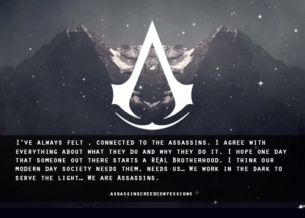

# Coder's Creed.
## Nothing is true; everything is permitted

<!-- <a href="#">
  
</a>
<a href="#"> -->
## We work in the dark to serve the light
  
</a>

### Welcome to my repo, you are visitor


### Top languages
[](https://github.com/anuraghazra/github-readme-stats)

Here are some ideas to get you started:

- 🔭 I’m currently studying at Northeastern University.
- 🌱 I’m currently learning data science, leetcode solution, quantitative strategy on crypto
- 👯 I’m looking to collaborate on some quantitative strategy on doge ,bit and eth
- 📫 How to reach me: yunethecoder@gmail.com
- 😄 Pronouns: he/him
- ⚡ Fun fact: Php is the best coding language.非常擅长写底层青年文学的coder。

<!--START_SECTION:waka-->


**🐱 My GitHub Data** 

> 📦 510.4 kB Used in GitHub's Storage 
 > 
> 🏆 0 Contributions in the Year 2026
 > 
> 🚫 Not Opted to Hire
 > 
> 📜 67 Public Repositories 
 > 
> 🔑 13 Private Repositories 
 > 
**I'm an Early 🐤** 

```text
🌞 Morning                39 commits          ⬛⬜⬜⬜⬜⬜⬜⬜⬜⬜⬜⬜⬜⬜⬜⬜⬜⬜⬜⬜⬜⬜⬜⬜⬜   05.98 % 
🌆 Daytime                346 commits         ⬛⬛⬛⬛⬛⬛⬛⬛⬛⬛⬛⬛⬛⬜⬜⬜⬜⬜⬜⬜⬜⬜⬜⬜⬜   53.07 % 
🌃 Evening                232 commits         ⬛⬛⬛⬛⬛⬛⬛⬛⬛⬜⬜⬜⬜⬜⬜⬜⬜⬜⬜⬜⬜⬜⬜⬜⬜   35.58 % 
🌙 Night                  35 commits          ⬛⬜⬜⬜⬜⬜⬜⬜⬜⬜⬜⬜⬜⬜⬜⬜⬜⬜⬜⬜⬜⬜⬜⬜⬜   05.37 % 
```
📅 **I'm Most Productive on Saturday** 

```text
Monday                   115 commits         ⬛⬛⬛⬛⬜⬜⬜⬜⬜⬜⬜⬜⬜⬜⬜⬜⬜⬜⬜⬜⬜⬜⬜⬜⬜   17.64 % 
Tuesday                  107 commits         ⬛⬛⬛⬛⬜⬜⬜⬜⬜⬜⬜⬜⬜⬜⬜⬜⬜⬜⬜⬜⬜⬜⬜⬜⬜   16.41 % 
Wednesday                68 commits          ⬛⬛⬛⬜⬜⬜⬜⬜⬜⬜⬜⬜⬜⬜⬜⬜⬜⬜⬜⬜⬜⬜⬜⬜⬜   10.43 % 
Thursday                 127 commits         ⬛⬛⬛⬛⬛⬜⬜⬜⬜⬜⬜⬜⬜⬜⬜⬜⬜⬜⬜⬜⬜⬜⬜⬜⬜   19.48 % 
Friday                   66 commits          ⬛⬛⬛⬜⬜⬜⬜⬜⬜⬜⬜⬜⬜⬜⬜⬜⬜⬜⬜⬜⬜⬜⬜⬜⬜   10.12 % 
Saturday                 129 commits         ⬛⬛⬛⬛⬛⬜⬜⬜⬜⬜⬜⬜⬜⬜⬜⬜⬜⬜⬜⬜⬜⬜⬜⬜⬜   19.79 % 
Sunday                   40 commits          ⬛⬛⬜⬜⬜⬜⬜⬜⬜⬜⬜⬜⬜⬜⬜⬜⬜⬜⬜⬜⬜⬜⬜⬜⬜   06.13 % 
```


📊 **This Week I Spent My Time On** 

```text
🕑︎ Time Zone: America/New_York

💬 Programming Languages: 
No Activity Tracked This Week

🔥 Editors: 
No Activity Tracked This Week

🐱‍💻 Projects: 
No Activity Tracked This Week

💻 Operating System: 
No Activity Tracked This Week
```

**I Mostly Code in Python** 

```text
Python                   29 repos            ⬛⬛⬛⬛⬛⬛⬛⬛⬛⬛⬛⬛⬜⬜⬜⬜⬜⬜⬜⬜⬜⬜⬜⬜⬜   46.77 % 
Jupyter Notebook         10 repos            ⬛⬛⬛⬛⬜⬜⬜⬜⬜⬜⬜⬜⬜⬜⬜⬜⬜⬜⬜⬜⬜⬜⬜⬜⬜   16.13 % 
Java                     9 repos             ⬛⬛⬛⬛⬜⬜⬜⬜⬜⬜⬜⬜⬜⬜⬜⬜⬜⬜⬜⬜⬜⬜⬜⬜⬜   14.52 % 
HTML                     8 repos             ⬛⬛⬛⬜⬜⬜⬜⬜⬜⬜⬜⬜⬜⬜⬜⬜⬜⬜⬜⬜⬜⬜⬜⬜⬜   12.90 % 
JavaScript               4 repos             ⬛⬛⬜⬜⬜⬜⬜⬜⬜⬜⬜⬜⬜⬜⬜⬜⬜⬜⬜⬜⬜⬜⬜⬜⬜   06.45 % 
```


**Timeline**


 Last Updated on 20/06/2026 03:26:46 UTC
<!--END_SECTION:waka-->


